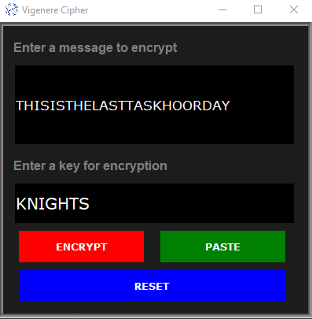

# The Vigenère Cipher

This is a program that asks the user for the plaintext and the keyword, then produces the ciphertext using the Vigenère cipher.

> The key is a keyword, which then translates into corresponding letter values of 0–25. Then, to encrypt, write the message on one row (letters 0–25) and repeatedly write the keyword below it, adding each column, taking the result as 26. These resultant numbers are the ciphertext.

**Here is a small example:**

```
Message: LETSGOTOTHESHOW 11  4 19 18  6 14 19 14   19    7   4    18    7   14     22

Key: TICKET              19 8   2 10 4  19 19   8    2   10   4   19   19    8       2

Add: 30 12 21 28 10 33 38 22 21 17 8 37 26 22 24

Mod: 4 12 21 2 10 7 12 22 21 17 8 11 0 22 24

Ciphertext: E M V C K H M W V R I L A W Y

````
## Documentation

Some basic info about the methods defined in the VigenereCipher and Interface classes

```
class VigenereCipher(builtins.object)
 |  #define a class which represents vigenere cipher
 |
 |  Methods defined here:
 |
 |  __init__(self)
 |      Initialize a new VigenereCipher object.
 |
 |  encrypt(self)
 |      Encrypts the message using the vigenere cipher algorithm and sets the
 |      ciphertext attribute with the uses the key and message attribute of the object
```

```
class Interface(builtins.object)
 |  #build a GUI for the Decryptor
 |  __init__(self)
 |      Initializes the interface window and runs the main loop.
 |  encrypt(self)
 |      Encrypts the message using the key and updates the GUI with the ciphertext.
 |
 |  paste(self)
 |      Pastes the contents of the system clipboard into the message or key text widget
 |
 |  reset(self)
 |      Clears the contents of input fields
```
## Demo
**User Input Interface**
<br>



<br>

**Output Display Format**
<br>


